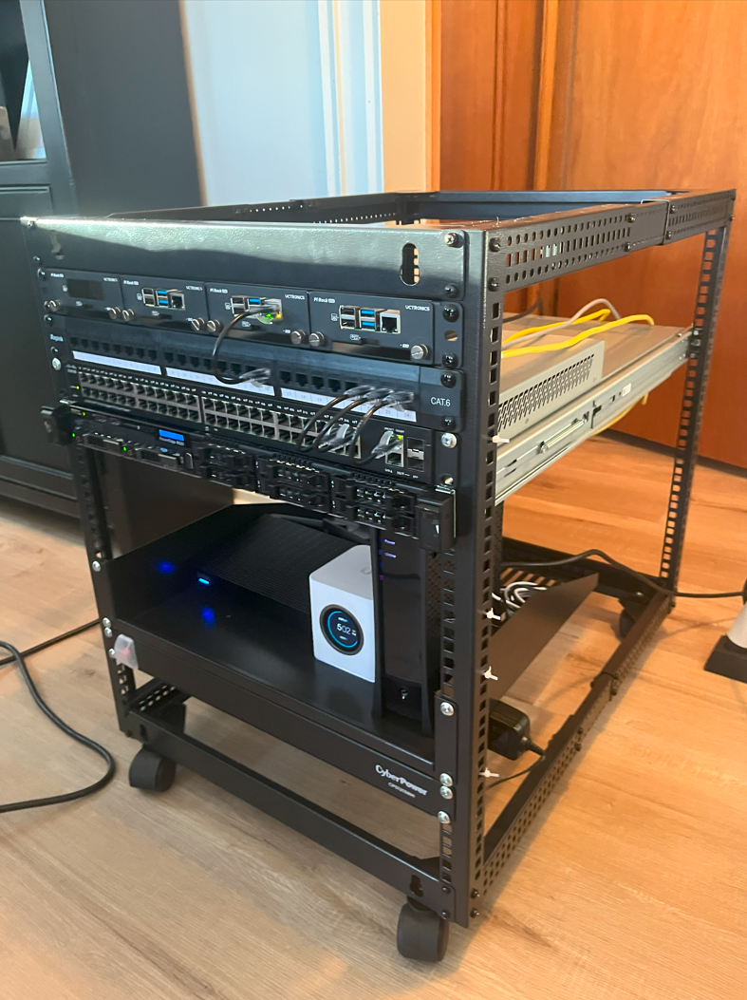

# DAC with Elastic SIEM

<figure><figcaption></figcaption></figure>


One of the coolest things I like most about the ELK stack is their team building Detection As Code (DAC) pipelines through the open-source GitHub project.



By following the instructions in the reference guide, you can create a DAC pipeline directly to your ELK stack from your IDE. There are a lot of cool features in the documentation, so you should check it out for more info.

My current setup deploys rules from my IDE to a Version Control System (VCS) and my ELK stack. One thing I have been working on is integrating this setup with MITRE Caldera for automated testing, based on the Atomic Red Team framework, and any new scripts you build on top of it.

For example, I just built a rule that detects usage of WinRM by checking logs for usage of port 5986 or 5985. After building this rule in our Elastic TOML file under our custom directory, we can use built-in commands to deploy it to our ELK stack and also sync with our GitHub repository.

```toml
[metadata]
creation_date = "2024/09/27"
maturity = "development"
updated_date = "2024/09/27"

[rule]
author = ["sam"]
description = "Detect WinRM Port Usage via svchost.exe or netsh.exe"
language = "eql"
name = "Detect WinRM Port Usage"
risk_score = 50
rule_id = "d3bfa7e7-5a7c-4f28-a0c9-3bf6e074b233"
severity = "medium"
type = "eql"

query = '''
process where 
  process.name == "svchost.exe" and 
  process.args : ("5985", "5986") or
  process.name == "netsh.exe" and 
  process.command_line like~ "*winrm*"
'''
```

Let's go through the development lifecycle to complete testing of this rule. First, we must validate the syntax and ensure the fields are accurate for the EQL data model. Run the following command:

```bash
python -m detection_rules validate-rule dac_custom_rules_dir/winRM.toml
```

After running this command, you should see a "Rule validation successful" message appear.

<figure><figcaption></figcaption></figure>

Navigate to your custom rules folder and run the following command to import your rules:

```bash
python -m detection_rules kibana import-rules
```

Navigate to your Kibana instance and go to **Security > Rules**. Select installed rules, and you should see your custom rule located inside the directory.

<figure><figcaption></figcaption></figure>

<figure><figcaption></figcaption></figure>

<figure><figcaption></figcaption></figure>

Now, let's commit our changes to our GitHub repo and sync to our remote repository.&#x20;

<figure><figcaption></figcaption></figure>

The rule is now deployed to the remote Git repository.

<figure><figcaption></figcaption></figure>

In the next blog, we are going to write a script to automate this process using GitHub workflows. We will also begin to automate the testing/validation through Breach and Attack Simulation (BAS) testing by communicating with MITRE Caldera's API for automated deployment.

You can check out my EQL repo for free content:






