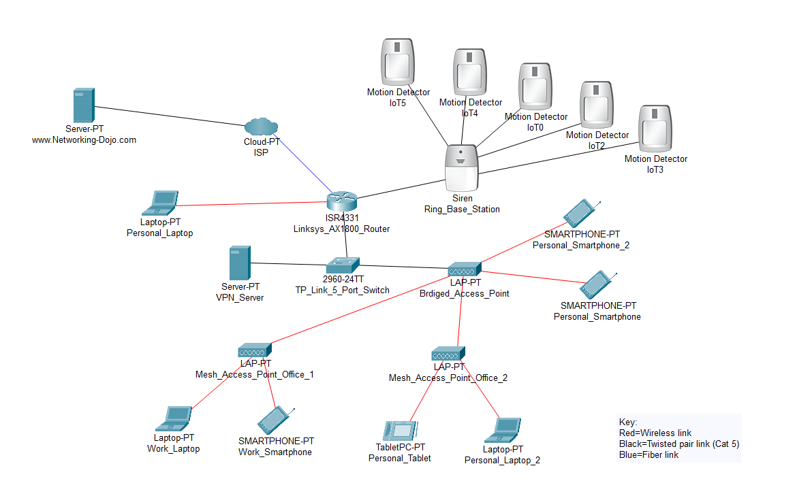

# Detecting Discovery commands

We are going to review logs in Splunk based on our BAS testing of Discovery techniques from MITRE Caldera. One discovery technique we want to detect is identifying which antivirus software is running on a machine. An attacker can use this information to disable or evade detection by the antivirus. We can review the report generated by the red team in [Breach and Attack Simulation (BAS)](../../homelab/test-range/breach-and-attack-simulation-bas.md).

<figure><figcaption></figcaption></figure>

With this information, we can head over to our Splunk instance to check if we have any logs related to the discovery of antivirus programs.

<figure><figcaption></figcaption></figure>

It looks like we have a few Sysmon logs from our Windows machine, which we can use to help build a detection for this technique.

Using the Sigma extension in VSCode, we can create a new Sigma rule based on what we observed in Splunk.

<figure><figcaption></figcaption></figure>

Select "Sigma converter" to convert the query to a new backend.

<figure><figcaption></figcaption></figure>

Head on over to the next blog to see how we can utilize CI/CD to send this query to our GitHub repository.&#x20;
