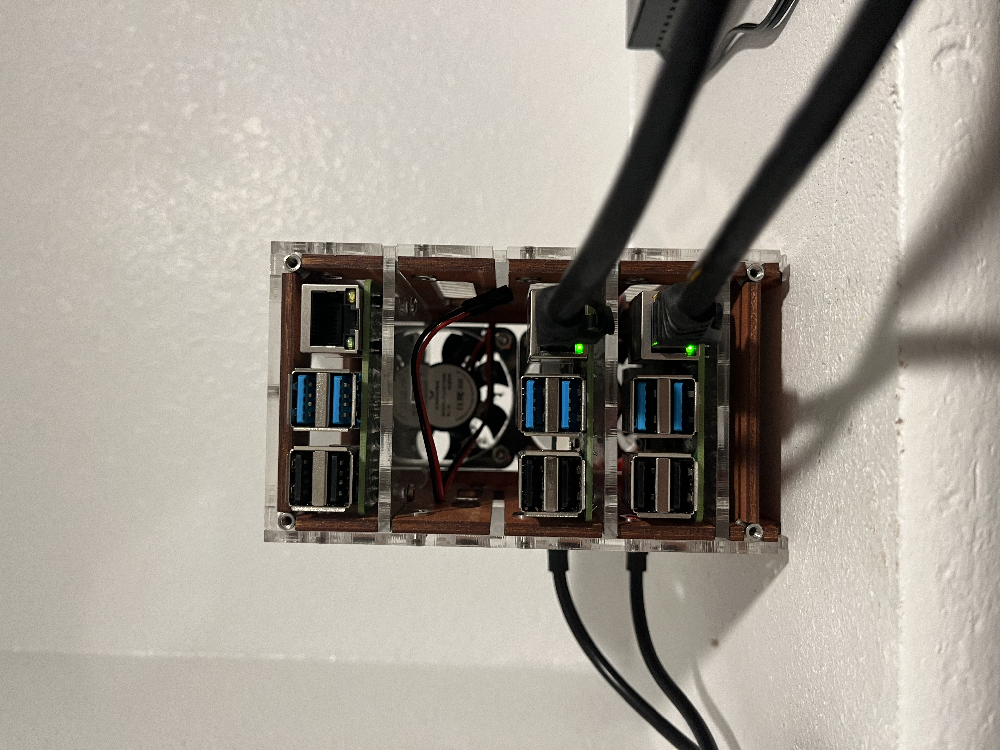

# OpenVPN on Raspberry Pi

Here is a helpful link for setting up OpenVPN on your Raspberry Pi. I currently run it on my Raspberry Pi 4 at home.

[https://pimylifeup.com/raspberry-pi-vpn-server/](https://pimylifeup.com/raspberry-pi-vpn-server/)

<figure><figcaption></figcaption></figure>

